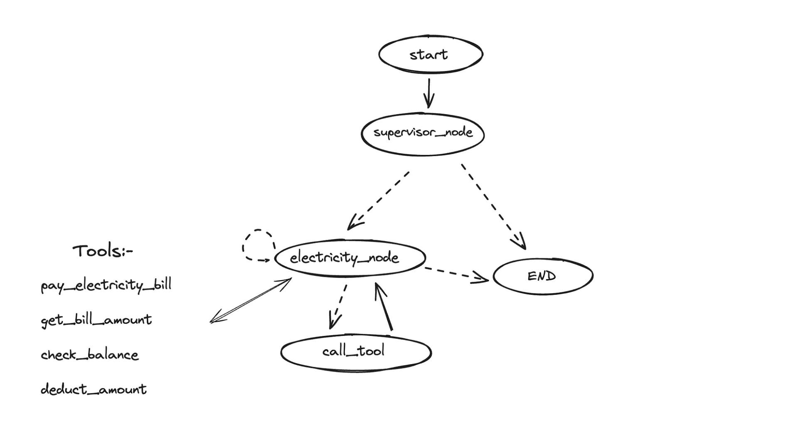

## Exploring tests for LLM Agents

A Large Language Model (LLM) agent can carry out a variety of tasks on behalf of a user, in additon to answering queries. Given a task, typically the agent autonomously decides the next best action to be executed and proceeds. The enduser will only get the final result once all the intermediate actions are performed. Hence, in real world settings, it makes it all the more important to test out different corner cases that the agent might encounter at different stages.

In this repository I explore how I can leverage the [Pytest](https://docs.pytest.org/en/stable/) framework for testing intermediate stages of LLM agents.

For demo purposes, I use the [Langgraph](https://www.langchain.com/langgraph) framework to create a bill paying agent. The design of the agent is as shown: 

### Notes:
- The main test file is in [test_graph.py](test_graph.py)
- The agent building logic is in [graph_builder.py](graph_builder.py)
- The mock data for tests can be added within [data_mocker.py](graph_builder.py)
- To get more insights about this repo, do check out the article I wrote where I have used this repo as a running example [here](https://medium.com/pythoneers/towards-developing-tests-for-large-language-model-enabled-apis-946e04c9ed65)

#### To run the tests:
- Install the requirements using `pip install -r requirements.txt`
- Create a `.env` in the root directory with a key from OpenAI. Set the `OPENAI_API_KEY`.
- Run `pytest -s`
